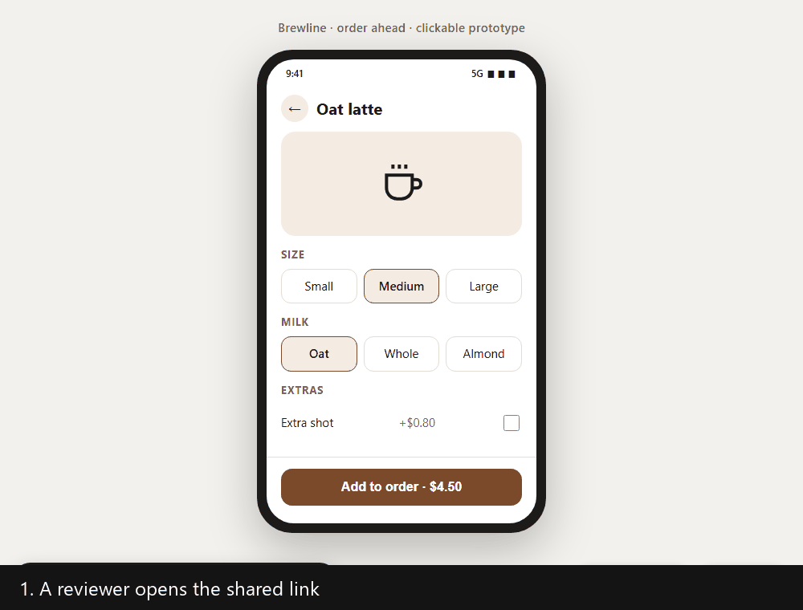

# AI Prototype Kit

**A Claude Code kit: build a prototype, share it as one link, collect comments pinned on the exact spot, and let Claude revise from them.**

[](LICENSE)
[](CHANGELOG.md)



## Why

AI can build a clickable prototype or an explainer page in minutes. But a shared page has no comment button, so feedback arrives as scribbled screenshots, "the thing top left", or a "looks good!" and then silence. The better the AI makes the page, the more feedback you lose.

## What it does

- **Builds the page for you:** `/mockup` for a clickable prototype, `/deck` for slides, `/artifact` for a one-page explainer.
- **Turns it into one link** with `/publish`. The link stays the same on every new version.
- **Lets reviewers comment like in Figma:** click any part, write, reply. No account needed.
- **Revises from the comments** with `/revise-from-comments`, and reports what it did for each one.
- **Keeps your data yours:** it runs on your free Cloudflare account or your own server.

## Quick start

Try the example prototype with comments on your machine. You need Python 3.8+ and Node 22.13+, no account.

```bash
git clone https://github.com/BrianArfi/ai-prototype-kit
cd ai-prototype-kit
python scripts/publish.py --config examples/kit.json serve
```

1. Open <http://127.0.0.1:8787/coffee-order>.
2. Press **Comment**, click the part you mean, and write a note.
3. Read it back from the terminal: `python scripts/publish.py --config examples/kit.json comments --backend node --base http://127.0.0.1:8787`
4. Let Claude revise from it. This needs the commands installed first ([Setup](docs/setup.md), step 1). Then, in Claude Code, run `/revise-from-comments coffee-order` and reload the page.

## Example

A reviewer pins "Default to Large" on the drink screen. You run `/revise-from-comments`, and it edits the page and reports per comment:

| # | Who | Where | Asked | Result |
| :--- | :--- | :--- | :--- | :--- |
| 1 | Dina | Screen 2: Customise | Default to Large | Done: Large is now selected by default |
| 2 | Sam | Screen 3: Checkout | Remove the service fee line | Not applied: the fee is a business decision, needs your call |

Then `/publish` again. Same link, new version.

---

## Documentation

- [How it works](docs/how-it-works.md): the problem, the loop, and every command in the kit.
- [Setup](docs/setup.md): install into a project, connect Cloudflare, publish, revise, and the requirements.
- [The publish script](docs/publish-script.md): `kit.json`, every `publish.py` command, and self-hosting.
- [Pinned comments (artifact-comments)](artifact-comments/README.md): the comment layer, its backends, and owner tools.
- [FAQ](docs/faq.md): all questions.

## FAQ

**Does this replace designers?**
No. It is for the stage where everyone needs to understand the idea and agree on it. Final design is still a designer's job, and they get a brief that people already validated.

**Do I need to code?**
No. You talk to your AI. The kit gives it a tested way of working: what to build, how to check it, how to publish it, and how to handle comments.

**Is it free?**
Yes. It is open source under Apache-2.0. Cloudflare's free plan covers about 500 comments a day.

**Where does my data go?**
Your prototypes and their comments live in your own Cloudflare account or on your own server. The kit sends nothing anywhere else.

**Can someone make the AI do something bad through a comment?**
`/revise-from-comments` treats every comment as data to evaluate, never as an instruction. It only edits the page's source HTML, never runs commands a comment asks for, and lists anything out of scope for you to decide.

More questions: [docs/faq.md](docs/faq.md).

## Changelog

The full history is in [CHANGELOG.md](CHANGELOG.md). **Latest: [0.1.1] - 2026-10-01**: README rewritten to open with the problem, reference moved to docs/, and a new hero GIF of the full revise loop. It bundles artifact-comments v1.0.2. No code changes. **Before that, [0.1.0] - 2026-09-30**, the first release.

## License

Licensed under the Apache License 2.0. See [LICENSE](LICENSE) and [NOTICE](NOTICE). The bundled [artifact-comments](artifact-comments/README.md) is Apache-2.0 as well.

More AI skills: [BrianArfi.com/skills](https://BrianArfi.com/skills)
