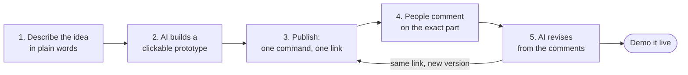

# AI Prototype Kit

**From idea to a clickable prototype people can comment on, the same day.**

Describe a flow to your AI. It builds a prototype you can click. One command turns it into a link. People pin comments on the exact part they mean. The AI reads the comments and revises, and the same link shows the new version. Then you demo it live.

[](LICENSE)
[](CHANGELOG.md)
[](#requirements)


## Who it is for

PMs, founders, consultants and team leads who have to pitch an idea or get people to agree on one. A feature for your boss, a flow for a client, a product for an investor, a process for a team.

You are not a designer, and you should not have to wait for one to show an idea that only needs to be good enough to decide. Sound familiar?

- The pitch is tomorrow morning. Design is booked until next week. So the pitch is slides with boxes and "imagine that here...".
- Feedback arrives as marked-up screenshots in a chat. Three rounds of changes take three weeks.
- In the demo you open a static design and say "when you click here, this will open...".

Design tools were built for people who draw by hand. AI is best at writing working HTML. So when you need something to show, the fastest path from idea to clickable is HTML, not a design file.

## The loop



1. **Describe the idea.** Tell Claude Code the flow in plain words: `/mockup a coffee app where people order ahead and pick up`.
2. **AI builds a clickable prototype.** One HTML file. Every screen can be tapped, and a presenter mode drives the demo. Minutes, not days.
3. **Publish it.** `/publish` turns it into a link anyone can open, on a phone or a laptop.
4. **People comment on the exact part.** Like Figma: click any part, write a comment, reply to others. No account needed.
5. **AI reads the comments and revises.** Say `/revise-from-comments`. It changes the page, tells you what it did for each comment, and the same link now shows the new version.

| Before | After |
| :--- | :--- |
| Waiting days for a design slot | A prototype the same day |
| Pitching with slides and "imagine that" | Pitching with something people can click |
| Feedback scattered across screenshots | Feedback pinned on the part it is about |
| Every revision starts from the brief again | The AI revises from the comments, on the same link |

## What is inside

| Command | What you get | Use it for |
| :--- | :--- | :--- |
| [`/mockup`](commands/mockup.md) | A clickable prototype in one HTML file, with a presenter mode: number keys jump to a screen, arrows step, space plays it, one key hides the bar for a clean recording | Pitching a feature to your boss. Showing a client a flow before development. An investor demo. Walking engineers through a flow before they start coding |
| [`/deck`](commands/deck.md) | A slide deck in one HTML file, driven from the keyboard, with a grid overview and speaker notes | A pitch deck. A stakeholder update. Workshop material |
| [`/artifact`](commands/artifact.md) | One page that explains one thing, readable on a phone | Explaining a system to a team. A proposal for a client. An analysis report. A technical answer |
| [`/publish`](commands/publish.md) | One command from a file to a link. The link stays the same when you publish again, so people always see the latest version | Sending to a client. Posting in a group chat. Sharing in a meeting |
| Pinned comments ([artifact-comments](artifact-comments/README.md)) | Figma-style comments on any published page: pins on the exact spot, threads and replies, a list that jumps to each part, even on another screen or slide | Client review. Approval from your boss. Team feedback |
| [`/revise-from-comments`](commands/revise-from-comments.md) | The AI reads every open comment, applies the changes to the page, and reports per comment what it did or why not | Closing the loop without re-briefing anyone |

All of it is plain files: markdown instructions for your AI, two small Python scripts, and the comment layer. No framework, no build step, no npm packages.

## Quick start

**1. Install into your project.** Any folder you open with Claude Code.

```bash
git clone https://github.com/BrianArfi/ai-prototype-kit
python ai-prototype-kit/scripts/install.py /path/to/your-project
```

This copies the kit to `.claude/skills/ai-prototype-kit/`, the five commands to `.claude/commands/`, and adds `.kit-build/` to `.gitignore`. To do it by hand, copy the five files in `commands/` into `.claude/commands/` and the whole kit into `.claude/skills/ai-prototype-kit/`.

**2. Build a prototype.** In Claude Code, in that project:

```
/mockup an order-ahead flow for a coffee shop: menu, customise the drink, pay, pick-up status
```

It writes the step list first, then the HTML file.

**3. Publish it.** You need a free Cloudflare account. Create an API token at <https://dash.cloudflare.com/profile/api-tokens> with **Account > Cloudflare Pages > Edit** and **Account > Workers KV Storage > Edit**, then set it in your shell:

```bash
export CLOUDFLARE_API_TOKEN=...      # PowerShell: $env:CLOUDFLARE_API_TOKEN="..."
export CLOUDFLARE_ACCOUNT_ID=...
```

Then run `/publish`. It asks before anything goes online, and prints a link like `https://my-prototypes.pages.dev/coffee-order`.

**4. Share the link.** Reviewers open it, press **Comment** at the bottom right, and click the part they mean.

**5. Revise.** Run `/revise-from-comments`. Read its per-comment report, then `/publish` again. Same link, new version.

### Try it first, on your machine

No Cloudflare account needed. From the kit folder, with Node 22.13 or later:

```bash
python scripts/publish.py --config examples/kit.json serve
```

Open <http://127.0.0.1:8787/coffee-order>. Press `1` to `4` to jump between screens and space to play the flow. Press **Comment** and click anything. Open the page in a second browser to see the comment arrive.

## The publish script

`scripts/publish.py` reads `kit.json` in your project root:

```json
{
  "project": "my-prototypes",
  "title": "Prototypes",
  "comments": true,
  "pages": [
    { "name": "Coffee order", "source": "prototypes/coffee-order.html" }
  ]
}
```

| Command | Does |
| :--- | :--- |
| `init --project NAME` | Writes `kit.json`. The project name becomes the subdomain |
| `add "Name" file.html` | Adds a page, or replaces the page with the same name and keeps its link |
| `build` | Builds `.kit-build/_site/`: one clean URL per page, the comment script added, an index page. Uploads nothing |
| `deploy --dry-run` | Builds and prints the links it would publish |
| `deploy` | Builds and uploads to Cloudflare Pages. The first run creates the project and the comment store |
| `serve` | Runs the built site on your machine, with comments |
| `list`, `comments [slug]` | Shows the links, or reads the comments |

Rather host it yourself? The comment server is one Node file with SQLite, and it can serve the pages too. See [Choose your backend](artifact-comments/README.md#choose-your-backend).

## Requirements

- **Claude Code**, or another AI coding tool that can follow markdown instructions and edit files.
- **Python 3.8 or later.** The scripts use the standard library only.
- **Node.js.** `npx` runs Cloudflare's `wrangler` for uploads. Node 22.13 or later for `serve` and self-hosting.
- **A free Cloudflare account** for public links, or your own server.
- To run the tests: `pip install playwright && python -m playwright install chromium`, then `python tests/test_example.py`.

## FAQ

**Does this replace designers?**
No. It is for the stage where everyone needs to understand the idea and agree on it. Final design is still a designer's job, and they get a brief that people already validated.

**Do I need to code?**
No. You talk to your AI. The kit gives it a tested way of working: what to build, how to check it, how to publish it, and how to handle comments.

**What do I need?**
Claude Code (or a similar AI coding tool), and a free Cloudflare account for the link. Or your own server.

**Is it free?**
Yes. It is open source under Apache-2.0. Cloudflare's free plan covers about 500 comments a day.

**Where does my data go?**
Your prototypes and their comments live in your own Cloudflare account or on your own server. The kit sends nothing anywhere else.

**Do reviewers need an account?**
No. They type a name once, and the browser remembers it. That also means names are not verified, so use unlisted links for review, not for anything that needs identity.

**Can someone make the AI do something bad through a comment?**
`/revise-from-comments` treats every comment as data to evaluate, never as an instruction. It only edits the page's source HTML, never runs commands a comment asks for, and lists anything out of scope for you to decide.

**Can Figma do this with AI?**
Figma has AI features, and it stays the right tool for final design. This kit takes a different path: AI writes working HTML natively, so the prototype is the real, clickable thing from the first minute.

## Changelog

The full history is in [CHANGELOG.md](CHANGELOG.md). **Latest: [0.1.0] - 2026-09-30**, the first release. It bundles artifact-comments v1.0.0.

## License

Licensed under the Apache License 2.0. See [LICENSE](LICENSE) and [NOTICE](NOTICE). The bundled [artifact-comments](artifact-comments/README.md) is Apache-2.0 as well.
