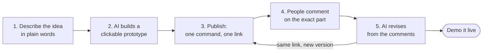

# How it works

[Back to the README](../README.md)

## The best way to explain something now

In the AI era, the best way to explain an idea is visual, and AI builds it in minutes. That beats a long document, a slide full of boxes, or a week of waiting for a design file.

| Command | What AI builds | Example |
| :--- | :--- | :--- |
| [`/artifact`](../commands/artifact.md) | An explainer page: a system, a proposal, a report. One page, readable on a phone | `/artifact how our refund process works, for the support team` |
| [`/mockup`](../commands/mockup.md) | A clickable prototype of a flow, with a presenter mode for live demos | `/mockup an order-ahead flow for a coffee shop, for the investor meeting` |

## But when you share it, people do not know how to comment

A shared page has no comment button like the one in Figma or Google Docs. So the feedback goes somewhere else, or nowhere:

- A screenshot with scribbles on it, sent in a chat.
- "The thing top left, that one." Which thing?
- "Looks good!", and then nothing, because commenting is a hassle.
- Feedback spread across three chats and two email threads.

The better your AI makes the explanation, the more feedback you lose.

## The fix: comments on the page, then AI revises

This kit makes every AI-made page commentable like Figma. Reviewers click any part, write, and reply to each other. No account needed. Then the AI reads every comment, revises the page, and tells you what it did for each one. The link stays the same, so you demo the latest version.

| Before | After |
| :--- | :--- |
| Feedback in screenshots and chats | Feedback pinned on the part it is about |
| "Looks good!" and silence | One click to comment, so people do |
| Every revision starts from the brief again | The AI revises from the comments, on the same link |
| Waiting days for a design slot | A prototype the same day |

## Who it is for

PMs, founders, consultants and team leads who have to pitch an idea or get people to agree on one: a feature for your boss, a flow for a client, a product for an investor, a process for a team. You do not have to be a designer. Final design stays with designers; this is for the stage where everyone needs to understand and agree.

## The loop

1. **Describe the idea.** Tell Claude Code the flow in plain words: `/mockup a coffee app where people order ahead and pick up`.
2. **AI builds a clickable prototype.** One HTML file. Every screen can be tapped, and a presenter mode drives the demo. Minutes, not days.
3. **Publish it.** `/publish` turns it into a link anyone can open, on a phone or a laptop.
4. **People comment on the exact part.** Like Figma: click any part, write a comment, reply to others. No account needed.
5. **AI reads the comments and revises.** Say `/revise-from-comments`. It changes the page, tells you what it did for each comment, and the same link now shows the new version.

## What is inside

| Command | What you get | Use it for |
| :--- | :--- | :--- |
| [`/mockup`](../commands/mockup.md) | A clickable prototype in one HTML file, with a presenter mode: number keys jump to a screen, arrows step, space plays it, one key hides the bar for a clean recording | Pitching a feature to your boss. Showing a client a flow before development. An investor demo. Walking engineers through a flow before they start coding |
| [`/deck`](../commands/deck.md) | A slide deck in one HTML file, driven from the keyboard, with a grid overview and speaker notes | A pitch deck. A stakeholder update. Workshop material |
| [`/artifact`](../commands/artifact.md) | One page that explains one thing, readable on a phone | Explaining a system to a team. A proposal for a client. An analysis report. A technical answer |
| [`/publish`](../commands/publish.md) | One command from a file to a link. The link stays the same when you publish again, so people always see the latest version | Sending to a client. Posting in a group chat. Sharing in a meeting |
| Pinned comments ([artifact-comments](../artifact-comments/README.md)) | Figma-style comments on any published page: pins on the exact spot, threads and replies, a list that jumps to each part, even on another screen or slide | Client review. Approval from your boss. Team feedback |
| [`/revise-from-comments`](../commands/revise-from-comments.md) | The AI reads every open comment, applies the changes to the page, and reports per comment what it did or why not | Closing the loop without re-briefing anyone |

All of it is plain files: markdown instructions for your AI, two small Python scripts, and the comment layer. No framework, no build step, no npm packages.
